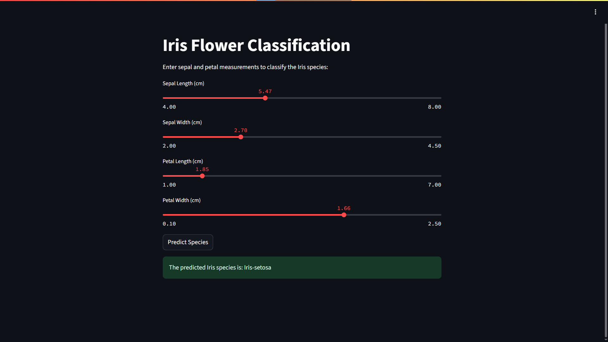

# 🌸 Iris Flower Classification Web App

This is a **machine learning-powered web application** that classifies Iris flowers into one of three species — **Setosa**, **Versicolor**, or **Virginica** — based on four flower measurements.  
Built using **Streamlit** and hosted live on **Render**.

🔗 **Live App:** [https://iris-classifier-ljr5.onrender.com](https://iris-classifier-ljr5.onrender.com)

---

## 🗂️ Project Location

This project is part of the [`CODSOFT`](https://github.com/your-username/CODSOFT) monorepo under the folder:

```
CODSOFT/iris-classifier/
```

---

## 📊 Dataset

This project uses the famous [Iris Dataset](https://archive.ics.uci.edu/ml/datasets/iris), which includes:
- Sepal Length
- Sepal Width
- Petal Length
- Petal Width
- Species Label

The dataset is included as a local file: `IRIS.csv`.

---

## 🚀 Features

- 📏 Interactive sliders to input flower measurements
- 🌺 Instant species prediction using a trained Random Forest model
- 🧠 Model is trained on startup (lightweight and fast)
- 📡 Deployed online for global access using **Render**
- 🖼️ Minimal and clean UI with **Streamlit**

---

## 🛠️ How to Run the App Locally

### 1. Clone the Repo and Navigate to Project
```bash
git clone https://github.com/your-username/CODSOFT.git
cd CODSOFT/iris-classifier
```

### 2. Install Dependencies
```bash
pip install -r Requirement.txt
```

### 3. Run the Web App
```bash
streamlit run app.py
```

The app will open automatically in your browser at `http://localhost:8501`

---

## ☁️ Deployment (Render)

To deploy this project on [https://render.com](https://render.com):

1. Push the contents of `iris-classifier` folder to its own GitHub repository **or** connect the whole `CODSOFT` monorepo
2. On Render:
   - Create a **New Web Service**
   - Select the repo and set the root directory to `iris-classifier`
3. Fill in the build settings:
   - **Build Command:**
     ```bash
     pip install -r Requirement.txt
     ```
   - **Start Command:**
     ```bash
     streamlit run app.py --server.port=$PORT --server.enableCORS=false
     ```

Render will assign you a public URL after deployment is complete.

---

## 📁 Directory Structure

```
iris-classifier/
├── app.py              # Main Streamlit application
├── IRIS.csv            # Iris flower dataset
├── Requirement.txt     # Project dependencies
└── README.md           # Project documentation (this file)
```

---

## 🔍 Model Details

- **Algorithm:** Random Forest Classifier (from `scikit-learn`)
- **Features Used:**
  - Sepal Length
  - Sepal Width
  - Petal Length
  - Petal Width
- **Target Classes:** Setosa, Versicolor, Virginica

---

## 🖼️ Screenshot




---

## 👨‍💻 Author

**Shreyas Rai**  
[Linkedin Profile](https://www.linkedin.com/in/raishreyas/)
[Live App](https://iris-classifier-ljr5.onrender.com)

---

## 📄 License

This project is open-source under the [MIT License](https://choosealicense.com/licenses/mit/).

---

## 🙏 Acknowledgments

- Kaggle – [Iris Dataset](https://www.kaggle.com/datasets/arshid/iris-flower-dataset)
- Streamlit.io – for the awesome UI framework
- Render.com – for free app hosting

---